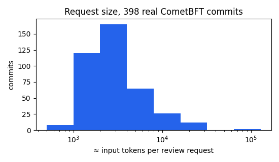
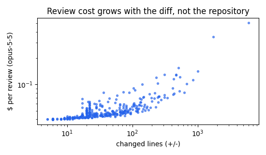

# Cost analysis from real commits

Source: 399 first-parent commits of CometBFT (`reference/cometbft`), 398 rendered (1 not reviewable: empty tree change). Tokens = request bytes × 0.381 (ratio measured with tiktoken cl100k_base on rendered requests; bytes/4 would give 0.25). Output tokens per review assumed 300 (+1500 billed thinking tokens on always-thinking models).

## 1. How big is a review request?

| statistic | files | +lines | request bytes | ≈ input tokens |
|---|---|---|---|---|
| p50 | 2 | 9 | 6779 | 2579 |
| p90 | 8 | 92 | 21129 | 8040 |
| p99 | 44 | 630 | 69551 | 26467 |
| max | 105 | 3436 | 308230 | 117294 |
| mean | 4.3 | 46 | 11252 | 4281 |

Commits with at least one opaque (binary/oversized) file: 8 (2.0 %) — under a policy with `allow_opaque=false` these could not be reviewed at all. Fixed overhead per request (system prompt + tool definition + header): 872 tokens at the smallest commit.

## 2. Cost of ONE review, by model

| model | $/M in | $/M out | p50 commit | p90 commit | p99 commit | mean | fixed part (output+thinking) |
|---|---|---|---|---|---|---|---|
| claude-fable-5-1 | 10.0 | 50.0 | $0.1158 | $0.1704 | $0.3547 | $0.1328 | $0.0900 |
| claude-opus-5-5 | 4.0 | 20.0 | $0.0463 | $0.0682 | $0.1419 | $0.0531 | $0.0360 |
| claude-sonnet-5-5 | 2.0 | 10.0 | $0.0232 | $0.0341 | $0.0709 | $0.0266 | $0.0180 |
| claude-haiku-4-5 | 1.0 | 5.0 | $0.0116 | $0.0170 | $0.0355 | $0.0133 | $0.0090 |

## 3. By change category (path-based), and a tiered policy

| category | commits | share | mean tokens | p90 tokens | mean $ (opus-5-5) |
|---|---|---|---|---|---|
| docs | 42 | 11 % | 7673 | 19915 | $0.0667 |
| tests | 17 | 4 % | 2826 | 6743 | $0.0473 |
| docs+tests | 6 | 2 % | 3234 | 7119 | $0.0489 |
| code | 234 | 59 % | 3474 | 6260 | $0.0499 |
| sensitive | 99 | 25 % | 5063 | 9276 | $0.0563 |

Tiered policy (docs/tests → haiku-4-5, code → sonnet-5-5, sensitive paths → opus-5-5) over all 398 commits: **$12.38** vs flat opus-5-5 **$21.14** (41 % less), flat sonnet-5-5 $10.57, flat fable-5-1 $52.86.

## 4. Growth with size

The request contains only the diff and the commit message, so cost is a function of the change, not of the repository. Marginal cost ≈ price_in × tokens; the fixed part (system prompt, tool, verdict, thinking) dominates below ~2k tokens.

