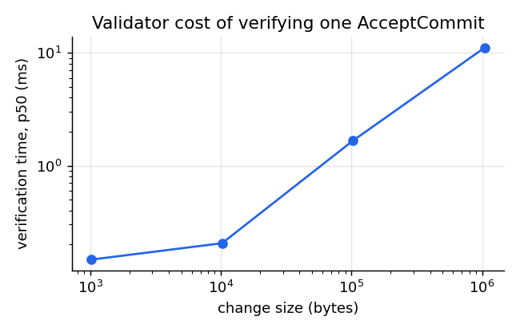
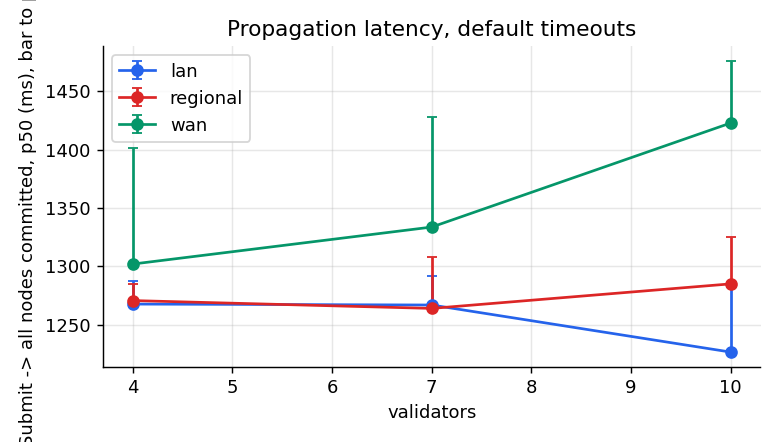
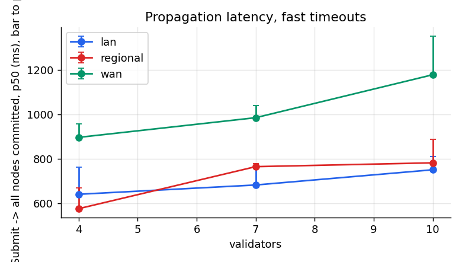
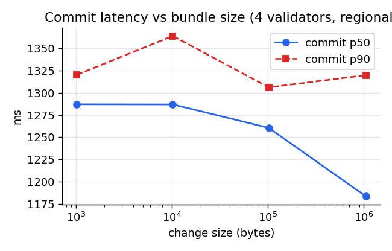
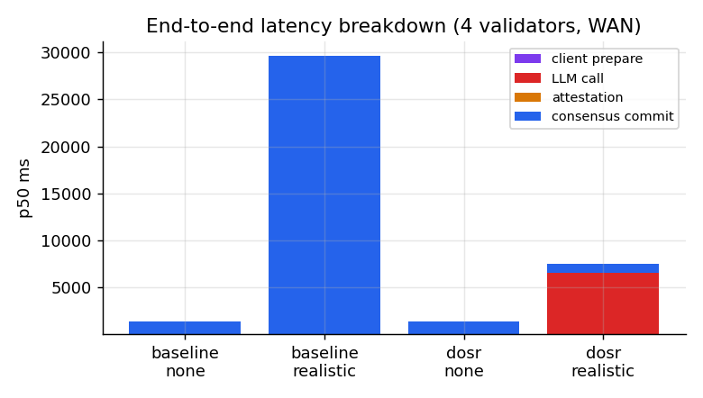
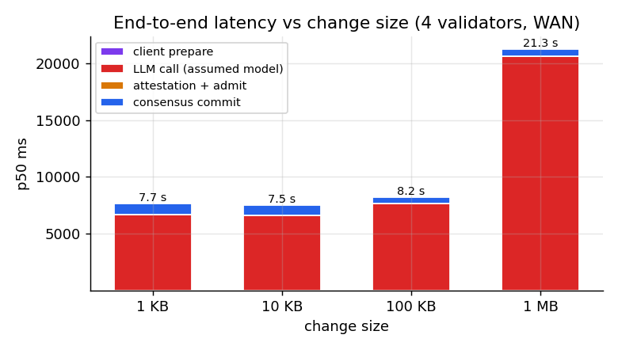
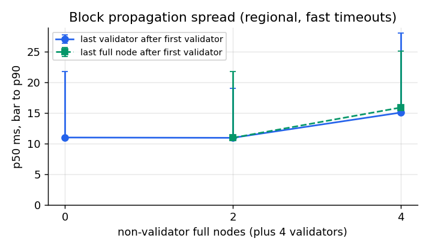
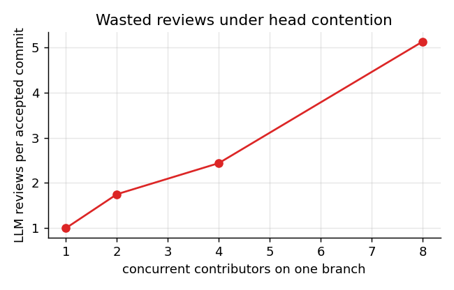
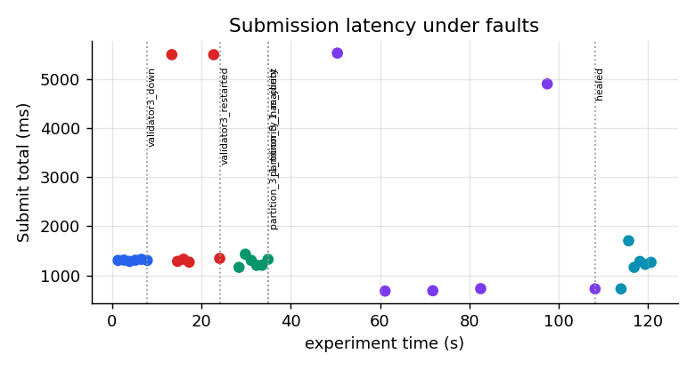

# Evaluation results

Generated by `eval/plot.py` from `eval/results/raw/*.json` (dosr-bench). All numbers: one Apple M-series laptop, 8 cores, in-process CometBFT nodes with emulated links; LLM latency is the mock provider's ASSUMED model (see `pkg/llm/model.go`). Percentiles are over accepted submissions; `commit` = broadcast admitted -> decided at the client's node; `decided_all` = Submit start -> last honest node committed the block; `total` = whole Submit call.

## Verification cost (in-process, cold cache)

| change bytes | tx bytes | p50 ms | p90 ms |
|---|---|---|---|
| 1024 | 3711 | 0.15 | 0.39 |
| 10240 | 12920 | 0.21 | 0.72 |
| 102400 | 105095 | 1.66 | 2.43 |
| 1048576 | 1051356 | 11.12 | 15.30 |

## Consensus latency vs validators and network (no LLM latency)

| validators | network | timeouts | commit p50 | commit p90 | decided-all p50 | decided-all p90 | block interval | rounds |
|---|---|---|---|---|---|---|---|---|
| 4 | lan | default | 1288 | 1323 | 1268 | 1288 | 21 intervals (heights 2..23): mean 1.287s median 1.297s p95 1.352s min 1.13s max 1.359s | {'1': 20} |
| 7 | lan | default | 1302 | 1335 | 1267 | 1292 | 21 intervals (heights 2..23): mean 1.305s median 1.307s p95 1.324s min 1.264s max 1.332s | {'1': 20} |
| 10 | lan | default | 1228 | 1305 | 1226 | 1282 | 21 intervals (heights 2..23): mean 1.244s median 1.245s p95 1.338s min 1.066s max 1.338s | {'1': 20} |
| 4 | regional | default | 1300 | 1306 | 1271 | 1285 | 21 intervals (heights 2..23): mean 1.301s median 1.298s p95 1.325s min 1.272s max 1.326s | {'1': 20} |
| 7 | regional | default | 1302 | 1340 | 1264 | 1308 | 21 intervals (heights 2..23): mean 1.305s median 1.307s p95 1.333s min 1.265s max 1.341s | {'1': 20} |
| 10 | regional | default | 1293 | 1395 | 1285 | 1325 | 21 intervals (heights 2..23): mean 1.315s median 1.308s p95 1.421s min 1.18s max 1.487s | {'1': 20} |
| 4 | wan | default | 1280 | 1380 | 1302 | 1401 | 21 intervals (heights 2..23): mean 1.33s median 1.296s p95 1.428s min 1.269s max 1.497s | {'1': 20} |
| 7 | wan | default | 1280 | 1440 | 1334 | 1428 | 21 intervals (heights 2..23): mean 1.354s median 1.306s p95 1.521s min 1.265s max 1.529s | {'1': 20} |
| 10 | wan | default | 1420 | 1486 | 1423 | 1476 | 21 intervals (heights 2..23): mean 1.446s median 1.462s p95 1.522s min 1.334s max 1.721s | {'1': 20} |
| 4 | lan | fast | 680 | 787 | 640 | 762 | 42 intervals (heights 2..44): mean 341ms median 314ms p95 403ms min 282ms max 434ms | {'1': 20} |
| 7 | lan | fast | 714 | 806 | 682 | 767 | 40 intervals (heights 2..42): mean 371ms median 393ms p95 421ms min 270ms max 448ms | {'1': 20} |
| 10 | lan | fast | 778 | 846 | 750 | 811 | 42 intervals (heights 2..44): mean 388ms median 389ms p95 464ms min 247ms max 547ms | {'1': 20} |
| 4 | regional | fast | 603 | 700 | 575 | 668 | 42 intervals (heights 2..44): mean 315ms median 304ms p95 390ms min 283ms max 402ms | {'1': 20} |
| 7 | regional | fast | 798 | 822 | 765 | 778 | 42 intervals (heights 2..44): mean 390ms median 397ms p95 427ms min 303ms max 436ms | {'1': 20} |
| 10 | regional | fast | 806 | 903 | 782 | 888 | 41 intervals (heights 2..43): mean 408ms median 404ms p95 493ms min 308ms max 524ms | {'1': 20} |
| 4 | wan | fast | 842 | 965 | 897 | 957 | 41 intervals (heights 2..43): mean 450ms median 458ms p95 522ms min 361ms max 528ms | {'1': 20} |
| 7 | wan | fast | 980 | 1004 | 985 | 1040 | 40 intervals (heights 2..42): mean 502ms median 499ms p95 593ms min 383ms max 618ms | {'1': 20} |
| 10 | wan | fast | 1168 | 1311 | 1179 | 1354 | 42 intervals (heights 2..44): mean 603ms median 594ms p95 719ms min 419ms max 880ms | {'1': 20} |

 

## Commit latency vs change size (bundle inside the transaction)

| change bytes | avg tx bytes | client prepare p50 ms | commit p50 ms | commit p90 ms |
|---|---|---|---|---|
| 1024 | 5847 | 0.17 | 1287 | 1320 |
| 10240 | 15087 | 0.77 | 1287 | 1364 |
| 102400 | 107267 | 3.37 | 1260 | 1306 |
| 1048576 | 1054206 | 12.64 | 1183 | 1320 |

## End-to-end latency breakdown and cost: DOSR vs every-validator-reviews

| mode | LLM latency | accepted | total p50 | total p90 | LLM call p50 | attest overhead p50 | commit p50 | rounds | provider calls | calls / accepted | cost USD |
|---|---|---|---|---|---|---|---|---|---|---|---|
| baseline | none | 10/10 | 1305 | 1441 | 0 | 0.0 | 1301 | {'1': 10} | 40 | 4.0 | 0.3443 |
| baseline | realistic | 10/10 | 29661 | 31221 | 0 | 0.0 | 29660 | {'5': 10} | 40 | 4.0 | 0.3444 |
| dosr | none | 10/10 | 1308 | 1386 | 2 | 0.8 | 1306 | {'1': 10} | 10 | 1.0 | 0.0860 |
| dosr | realistic | 10/10 | 7215 | 8182 | 6507 | 1.2 | 1020 | {'1': 10} | 10 | 1.0 | 0.0861 |

In baseline mode validators call the LLM while forming their vote; the 'commit' column then contains the validators' LLM calls (the notes column 'rounds' shows how many consensus rounds each block needed).

## End-to-end latency vs change size (DOSR, 4 validators, WAN, default timeouts, ASSUMED realistic LLM latency)

| change bytes | request bytes | tx bytes | accepted | client prepare p50 ms | LLM call p50 ms | attest overhead p50 ms | admit p50 ms | commit p50 ms | total p50 ms | total p90 ms | decided_all p50 ms |
|---|---|---|---|---|---|---|---|---|---|---|---|
| 1024 | 3410 | 5826 | 6/6 | 0.08 | 6662 | 0.3 | 0.2 | 1000 | 7745 | 8178 | 7747 |
| 10240 | 15663 | 15089 | 6/6 | 0.28 | 6568 | 0.4 | 0.5 | 960 | 7935 | 8070 | 7980 |
| 102400 | 137336 | 107269 | 6/6 | 1.82 | 7613 | 1.2 | 2.7 | 561 | 9279 | 10667 | 9304 |
| 1048576 | 1294612 | 1054064 | 6/6 | 6.77 | 20583 | 8.3 | 10.7 | 661 | 21271 | 35726 | 21305 |

The LLM call is the mock provider's ASSUMED model (ttft lognormal median 1.2 s, 60 output tok/s, 50 us per input token with tokens = bytes/4); its growth with size is the per-input-token term, not a measurement of any provider. 'attest overhead' = attestor time minus the upstream call; 'admit' = broadcast until CheckTx answered.

## Propagation to validators and non-validator full nodes (4 validators, regional, fast timeouts, no LLM latency)

| full nodes | accepted | commit p50 ms | first validator p50 ms | last validator p50 ms | validator spread p50 / p90 / max ms | last full node p50 ms | full-node spread p50 / p90 / max ms | last full node after first validator p50 / p90 / max ms | decided_all p50 ms | block interval |
|---|---|---|---|---|---|---|---|---|---|---|
| 0 | 10/10 | 601 | 553 | 567 | 11.0 / 21.7 / 23.0 | - | - | - | 567 | 22 intervals (heights 2..24): mean 305ms median 303ms p95 308ms min 290ms max 385ms |
| 2 | 10/10 | 700 | 649 | 659 | 10.9 / 19.0 / 24.9 | 660 | 3.0 / 8.6 / 8.9 | 10.9 / 21.7 / 27.6 | 662 | 22 intervals (heights 2..24): mean 351ms median 385ms p95 401ms min 292ms max 408ms |
| 4 | 10/10 | 784 | 737 | 753 | 15.0 / 28.0 / 115.0 | 753 | 12.2 / 17.0 / 19.1 | 15.8 / 25.1 / 115.0 | 753 | 22 intervals (heights 2..24): mean 392ms median 404ms p95 418ms min 291ms max 429ms |

Spreads are differences of the nodes' own commit timestamps (one clock, one machine) for the height that decided each submission; a full node follows consensus through the consensus reactor and commits when it has the block and +2/3 precommits.

## Head contention: optimistic concurrency cost

| contributors | accepted | reviews | reviews / accepted | wall s | accepted / min | cost USD |
|---|---|---|---|---|---|---|
| 1 | 4 | 4 | 1.00 | 5.2 | 46.2 | 0.0303 |
| 2 | 8 | 14 | 1.75 | 12.5 | 38.3 | 0.1081 |
| 4 | 16 | 39 | 2.44 | 21.2 | 45.3 | 0.3033 |
| 8 | 32 | 164 | 5.12 | 43.2 | 44.4 | 1.2874 |

## Faults: submission latency across crash, restart, partition, heal

| phase | n | failed | p50 ms | max ms |
|---|---|---|---|---|
| healthy | 6 | 0 | 1304 | 1325 |
| validator3_down | 6 | 0 | 1328 | 5503 |
| validator3_restarted | 6 | 0 | 1206 | 1430 |
| partition_3_1_minority_has_client | 0 | 1 | nan | nan |
| partition_3_1_majority | 6 | 0 | 722 | 5535 |
| healed | 6 | 0 | 1223 | 1705 |

Invariants after the run: ok. Notes: ['validator3_down: fault injected at +7.8s', 'validator3_restarted: fault injected at +24.2s', 'partition_3_1_minority_has_client: fault injected at +34.9s', 'partition_3_1_majority: fault injected at +34.9s', 'healed: fault injected at +108.2s']

## Approval grinding: intents + single-use nonces

| mode | p(approve) | trials | max tries | accepted | acceptance rate | expected (unbounded) | expected (bounded) | reviews / trial | refused by chain | refused by notary |
|---|---|---|---|---|---|---|---|---|---|---|
| intents_max3 | 0.25 | 20 | 12 | 13 | 0.65 | 0.97 | 0.578125 | 2.20 | 7 | 0 |
| no_intents | 0.25 | 20 | 12 | 19 | 0.95 | 0.97 | - | 3.85 | 0 | 0 |

